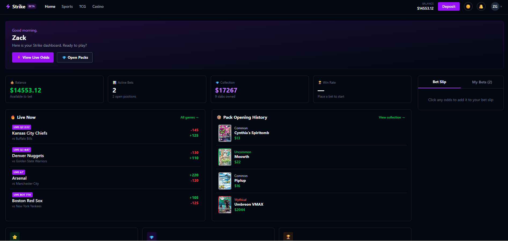

# Strike — Sportsbook & TCG Platform Case Study

Full-stack sports betting and trading card game platform built with React, FastAPI, and SQLite — case study covering architecture, engineering decisions, and feature design.

---

## Screenshots

<!-- Add screenshots here -->
<!-- Suggested: Landing page, Home dashboard, Pack Store, Pack opening flow, My Collection, CollectionSidebar history panel -->

| | |
|---|---|
|  |  |
|  |  |
|  |  |

---

## What is Strike

Strike is a simulated sports betting and trading card game platform. Users can place bets on live and upcoming sports events, pull cards from graded TCG packs across four rarity tiers, manage and track their card collection's live market value, and review their full sell/ship history — all backed by a persistent user account and balance.

The platform spans two main product areas:

**Sports Betting** — browse live and upcoming matches across multiple sports, view real-time moneyline odds, place single bets or multi-leg parlays via a persistent bet slip, and track active positions from the home dashboard.

**TCG Pack Opening** — browse packs across categories and rarity tiers (Bronze → Silver → Gold → Diamond), purchase and open packs with an animated card reveal, keep cards for your collection or sell immediately, and track every pull and sale in a persistent history log.

Built as a solo project over Spring 2026.

---

## Tech Stack

| Layer | Technology |
|---|---|
| Frontend | React 18 + Vite, React Router, Tailwind CSS |
| State | Zustand (balance, collection, bets, unopened packs, current user) |
| Backend | FastAPI (Python), SQLAlchemy (async ORM) |
| Database | SQLite (`brace.db`) |
| Charts / Animation | CSS keyframe animations, custom CSS properties for confetti |

---

## What I Built

### Sports Betting

- Built the live match feed with moneyline odds display, live/scheduled status badges, and per-match detail pages.
- Built the bet slip — persistent across navigation, supports single bets and multi-leg parlays, deducts balance on placement, and tracks open positions from the home dashboard.

### Pack Store & Pack Opening

- Built the pack store with category grouping (collapsible sections per TCG category), rarity tier cards with verbal odds descriptions, and accurate top-pull highlights pulled from the real card pool.
- Implemented the pack opening flow: animated two-stage card reveal (pack face flip → card reveal), rarity-weighted card pool selection, and a post-pull keep/sell decision that routes the card into the collection or immediately logs a sale.
- Engineered a confetti burst animation on card reveal — 40 pieces spawned from the card's perimeter edges, flying outward radially using CSS custom properties (`--burst-x`, `--burst-y`, `--burst-duration`, `--burst-delay`) for per-piece variation, colored to match the pulled card's rarity.

### Card Collection & History

- Built the My Collection view with rarity-colored card borders and labels, a rarity filter pill bar, and descending rarity sort when viewing all cards, so highest-rarity pulls always surface first.
- Built the CollectionSidebar with a live market value tracker (cosmetic price fluctuation on a timer), a Best Pull highlight with rarity-matched border color, and a Sold/Shipped history panel with tabs and an expandable full-history view.
- Added a persistent sell/ship history backed by a server-side `card_history` table — history survives logout and page refresh, and is recorded whether a card is sold immediately after a pull or later from the collection view.

### Home Dashboard

- Built the home dashboard surfacing four live stats (balance, active bets, collection market value, win rate), a Live Now feed of upcoming/live matches, a Pack Opening History panel showing recent pulls with rarity-colored thumbnails, and a promotions row.
- Wired deep-link navigation between the dashboard and TCG sub-tabs (pack store, collection) via React Router route state so buttons land on the correct tab without extra clicks.

### Backend & Data Model

- Implemented async FastAPI routes for users, cards, owned cards, pack tiers, pack purchases, unopened packs, and card history — all with SQLAlchemy async ORM and Pydantic schemas for request/response validation.
- Added a `card_history` table for persistent sell/ship records, with a `GET` endpoint (ordered by recency) and a `POST` endpoint, both wired into the frontend store's optimistic-update flow.
- Seeded the database with real graded Pokemon TCG cards across all four rarity tiers (Epic, Legendary, Mythical, and commons) using actual market values sourced from analytics data.

---

## Engineering Notes

**Optimistic UI with async fire-and-forget** — sells, ships, and pack pulls update local Zustand state immediately so the UI responds without waiting on the network. Backend calls run in the background and log errors to the console; on next load the server is authoritative. This keeps the feel instant without requiring rollback logic for a simulated platform.

**Perimeter-spawning confetti** — the confetti burst needed to feel like it was exploding off the card rather than falling from above. Each piece is spawned at a random point along the card's four edges (top, bottom, left, right) and given an outward radial velocity computed from its spawn position. CSS custom properties carry per-piece values into `@keyframes` so a single animation class handles all 40 pieces with no JS animation loop.

**Rarity-aware UI without hardcoded color strings** — all rarity colors (border, text, background tint) are centralized in a single `rarityColor(rarity)` utility that returns Tailwind class strings. Every component that needs rarity coloring — card borders in My Collection, the Best Pull thumbnail, the Pack History rows on the home page, confetti palette — calls the same function, so adding or renaming a rarity tier is a one-file change.

**Sell path from pack opening vs. collection** — selling a card from the collection goes through the `removeCard` store action. Selling immediately after a pull never enters the collection at all, so the original `recordPull` path needed its own `addCardHistory` call to avoid a gap in the history log. Keeping both paths explicit (rather than funneling through a shared helper) made it easier to reason about which API calls fire in which sequence.

**Non-destructive DB seeding** — `seed.py` is explicitly non-idempotent (marked in a comment) because the live database holds real user accounts, balances, and collection data. All schema changes after initial setup were applied via targeted SQLite scripts rather than re-running seed, and new tables (`card_history`) are created automatically by SQLAlchemy's `create_all` on server startup without touching existing tables.

**Category filter consistency** — the Pack Store and My Collection share the same left-nav category selector. "All" is always available and defaults open, with each TCG category collapsible beneath it in the store. Keeping "All" always visible (rather than hiding it on the store tab) means the selected category persists naturally when switching between store/collection/unopened tabs.

---

## Source

The full source is available in this repository. The backend seed data references real Pokemon TCG market values used for simulation purposes only — this is a non-commercial personal project.
